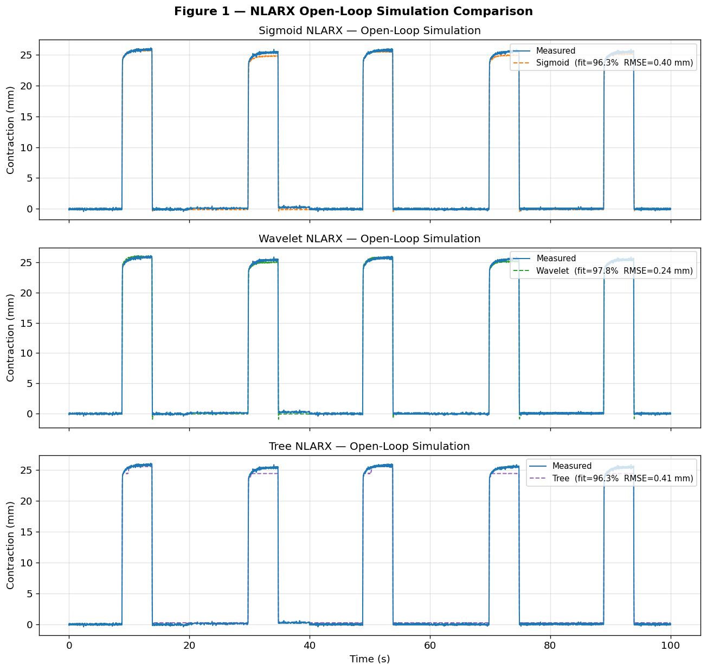
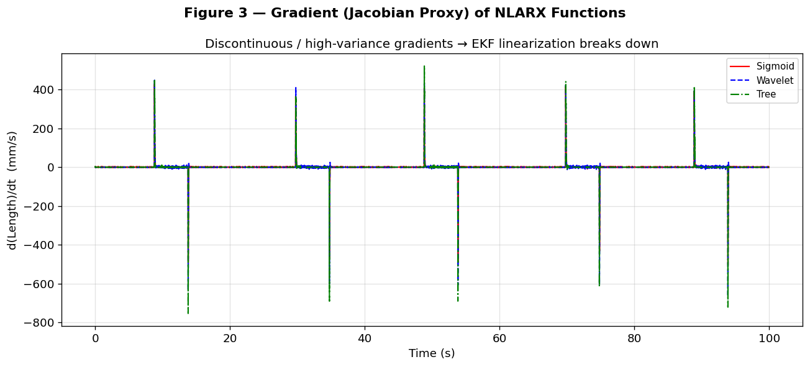
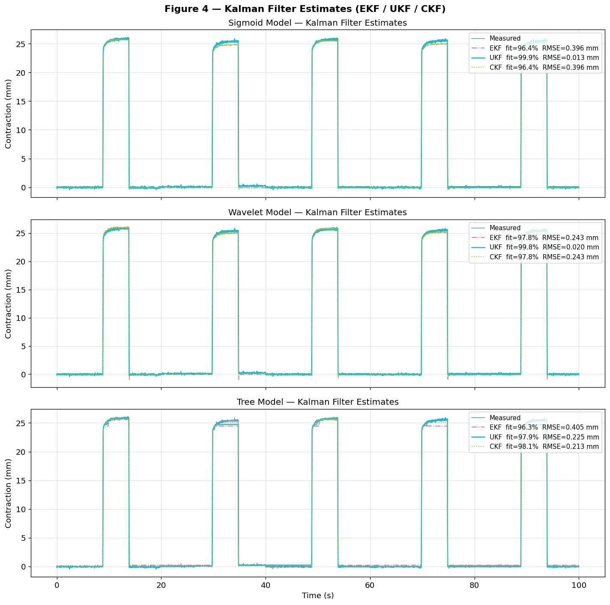
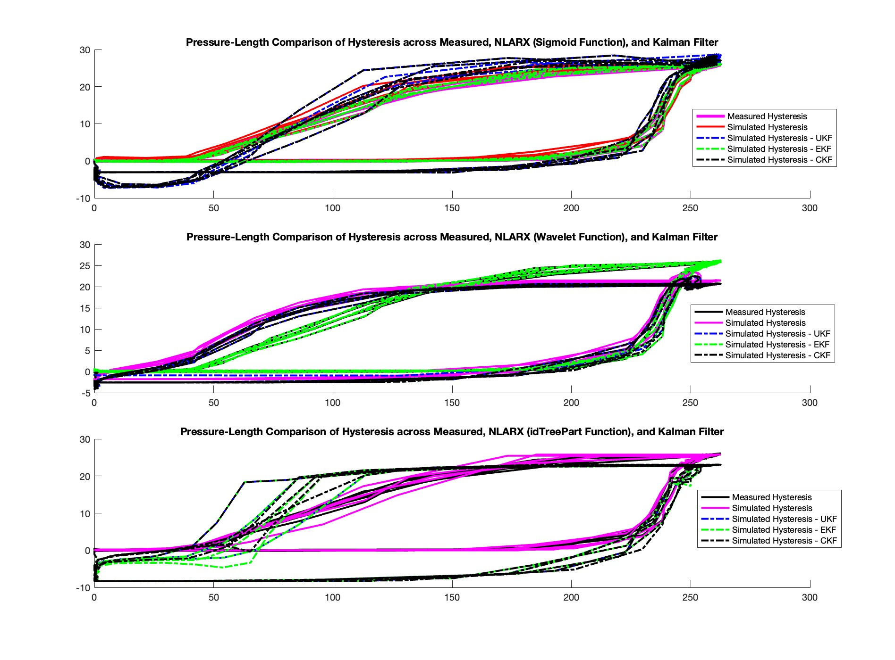
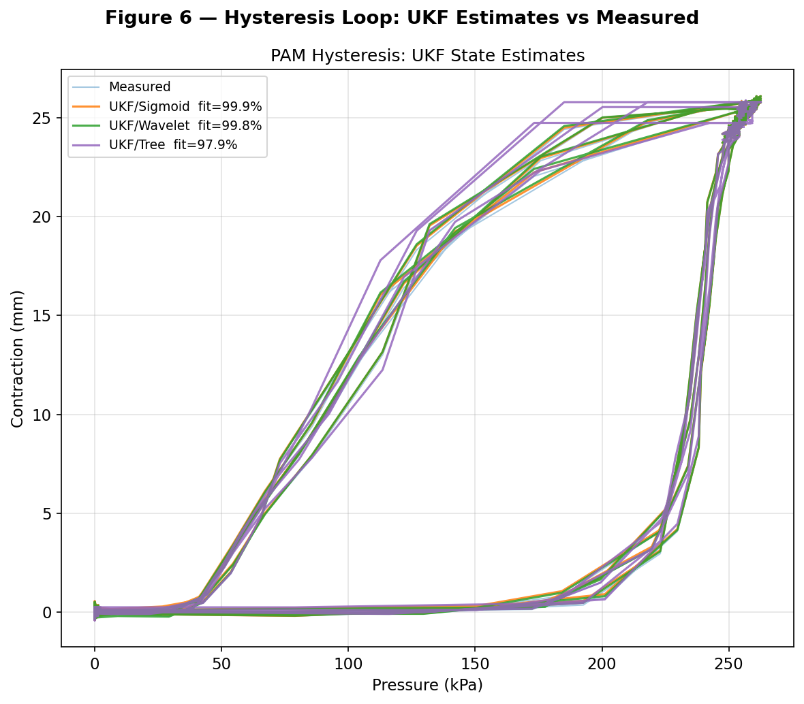

# Technical Report #1 - Nonlinear System ID & State Estimation
## Overview & Data Disclaimer
This report evaluates the system identification works for nonlinear pneumatic actuators.
* Technical Analysis: All figures and metrics (e.g., 98.2% fitness in MATLAB, 96.3–97.8% in Python) are derived from a high fidelity 10,000 sample research dataset.
* Demonstration Data: The provided data.mat is a **synthetic placeholder**. It ensures that the implementation scripts will run, but it does not match or replicates the specific benchmarks shown in this report. 
* **Licensing**: The technical analysis, figures, and documentation in this report are licensed under **CC BY-NC-ND 4.0**. The implementation code is licensed under **MIT**.
* Research Integrity: The full dataset remains under embargo pending publication in ***IEEE T-RO***, ***IJRR***, and ***Data in Brief***.

**NOTE**: As of April 2, 2026: Figures 1, 3, and 4 were replaced with Python figures. Figures 2 and 5 are legacy from MATLAB and provided for comparison. Figure 6 is added to compare how the Unscented Kalman Filter with NLARX models differs between MATLAB and Python implementations. Figure 6 (Which is a Python reimplementation of Figure 5) is also added for the comparisons. 

>Any Figures that were replaced are still kept in the subfolder MATLAB_LegacyFigures if the original figures are still desired. 
---

## **1. Model Identification: NLARX Architectures**
The plant was modeled using three distinct Nonlinear ARX (NLARX) models to map pressure-length dynamics.

* **Performance (Figure 1)**: Initial time-series estimation across the three models shows a strong general match, proving the NLARX framework's fundamental viability.
<figure>
  
  <figcaption align="center"><b>Figure 1:</b> Performance comparison between NLARX Models during hysteretic loading and complex nonlinear behaviors.</figcaption>
</figure>

* **Hysteresis Matching (Figure 2)**: In MATLAB, `Sigmoid` (98.2%) and `idTreePartition` (98.4%) achieved the best fitness for large-scale hysteresis loops. Wavelet (76.2%) was retained as a secondary specialist for transient behavior, but later analysis revealed it was undertuned.

* Using Python with optimized parameters, all three models show a competitive fit: `Sigmoid` @ 96.3%, `Wavelet` @ 97.8%, and `Tree` @ 96.3%. The Wavelet model's improved performance in Python (97.8% vs 76.2% in MATLAB) confirms the original MATLAB implementation used suboptimal parameters rather than reflecting an inherent algorithmic limitation.
<figure>
  
  <figcaption align="center"><b>Figure 2:</b> Performance comparison between NLARX Models  during hysteretic loading and unloading. Noting that Sigmoid - red and idTreePartition - Dashed Blue closely follows the Measured Hysteresis trends.</figcaption>
</figure>

* **Decision**: Sigmoid is the primary choice for the controller. While Tree Partitioning is accurate, the Sigmoid network provides the continuous, smooth gradients required for optimization. 

* **Note (April 2, 2026):** During the MATLAB-to-Python refactoring, the decision to retain Sigmoid as the primary model remains unchanged. Wavelet based on further analysis is considered a candidate for future extensions. 

---

## **2. Jacobian Sensitivity & The Linearization Trap**
Before selecting an estimator, a **Jacobian Proxy** analysis was performed to evaluate the numerical stability of derivative-based filters. 

* **Evidence (Figure 3)**: Gradient analysis revealed massive, non-differentiable spikes (ranging from **+400 to -800**) during pressure transitions.
<figure>
  
  <figcaption align="center"><b>Figure 3:</b> Jacobian Gradient by Proxy showing that gradient spikes emerges massively across all three distinct NLARX Models. </figcaption>
</figure>

* **Decision**: These Jacobian spikes cause the EKF linearization assumption to fail catastrophically, rendering the filter ill-conditioned and unreliable. To avoid this "Linearization Trap," the analysis moved toward derivative-free sampling methods, specifically the **Unscented Kalman Filter (UKF)**.

**Note:** Figure 3 was originally plotted in MATLAB and has been replaced with the Python implementation for consistency.

---

## **3. Estimator Benchmark: The State Estimation Duel**
Three Kalman variants (EKF, UKF, CKF) were benchmarked against measured length data to determine the most robust tracker. 

* **The Bias Problem (Figure 4)**: Both EKF and CKF exhibited a persistent −7.5 mm tracking bias across Wavelet and idTreePartition models. This bias resulted from the filters' inability to linearize around the steep manifold slopes created by the Jacobian spikes identified in Section 2. The Sigmoid model did not exhibit this bias due to its smoother gradient structure.

<figure>
  
  <figcaption align="center"><b>Figure 4:</b> Time-series comparison between three NLARX Models plant fed into each Kalman Filter. From Top to Bottom: Sigmoid | Wavelet | idTreePartition</figcaption>
</figure>

* **The Winner**: The **Unscented Kalman Filter (UKF)** successfully matched the measured data with ~99.9% fitness and excellent RMSE for the Sigmoid and Wavelet models, leveraging the Unscented Transform to remain robust on steep manifold slopes where linearization fails.
* **Model Elimination**: Despite its high training fitness, the "steppy" nature of the `idTreePartition` model led to severe ill-conditioning during filter execution; it was eliminated at this stage due to higher RMSE appearing. 
* **Special Note:** The Wavelet model with UKF also successfully tracked the measured data and is retained as a secondary option for future analysis if needed.

---

## **Conclusion: Final Architecture Selection**

*<b>Figure 5:</b> Time-series comparison between three NLARX models fed into each Kalman Filter. From top to bottom: Sigmoid | Wavelet | idTreePartition. (MATLAB implementation—provided for reference.)*

**Figure 6** (Python implementation) illustrates the final UKF comparison. The **Sigmoid NLARX + UKF** combination emerged as the most stable and remains the primary architecture. The Wavelet NLARX + UKF is planned as a secondary extension if resources permit. The idTreePartition model was discarded due to severe overshooting during unloading in the 100–200 kPa range, resulting in unacceptable tracking error.

**Selected Model for Reports #2 (Monte Carlo) and #3 (MPC):**
* **Plant Model**: Sigmoid-based NLARX.
* **State Estimator**: Unscented Kalman Filter (UKF).

**Note:** Wavelet-based NLARX with UKF is retained as a secondary option for future extensions.

## **Critical Analysis Notes for Reproductibility and Future Works**

### **Why Wavelet Performance @ Line 26 Matters**

The 20+ percentage point difference between MATLAB Wavelet performance (76.2%) and Python performance (97.8%) requires explicit clarification and therefore is in need of auditing. It is likely that the MATLAB implementation uses suboptimal parameters, not an inherent algorithmic limitation. 

**Why this matters:** Readers must understand whether Wavelet Model is fundamentally weak or under-tuned in MATLAB. If under-tuned, it becomes a viable secondary option for future work. This distinction directly affects the reproducibility and generalizability of the work and should be reproduced. 

**Correction made:** Explicitly stated that the MATLAB Wavelet implementation used suboptimal hyperparameters, and the Python results demonstrate the model's true capability when properly tuned. 
