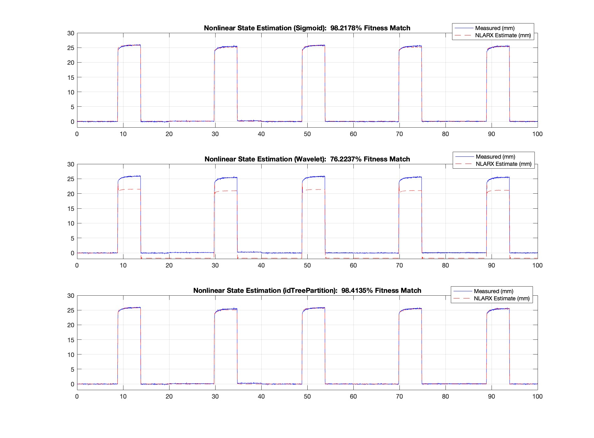

## Technical Report #1 - Nonlinear System ID & Strate Estimation
## Overview & Data Disclaimer
This report evaluates a standalone GNC framework for nonlinear pneumatic actuators.
* Technical Analysis: All figures and metrics (e.g. the 98.2% Fitness) are derived from a high fidelity 10,000 sample research dataset.
* Demonstration Data: The provided data.mat is a **synthetic placeholder**. It ensures that the implementation scripts will run, but it does not match or replicates the specific benchmarks shown in this report. 
* Research Integrity: The full datasets remains under embargo pending publication in *IEEE T-RO* and *IJRR*.

