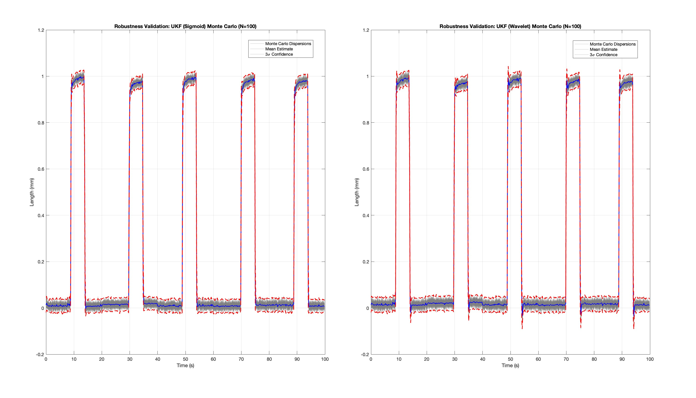
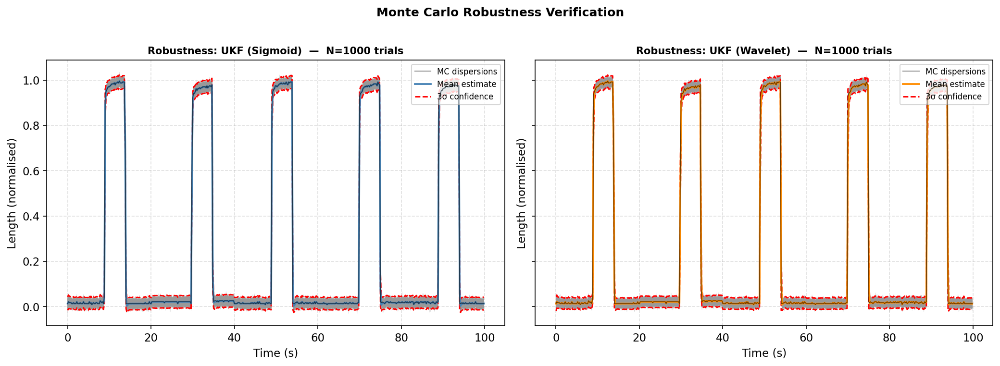

# **Technical Report #2 - Monte Carlo Validation of UKF Stability**

## **Overview & Data Disclaimer**
This report evaluates the statistical robustness of the state estimation framework. The original report subjected both the Sigmoid-NLARX and Wavelet-NLARX models to 100-run Monte Carlo Simulations downsampled to 1/20th of the sample size (500 samples) with MATLAB to validate the Unscented Kalman Filter (UKF) stability under randomized noise and initial conditions previously. Since then, the port from MATLAB to Python has enabled the 1:1 simulations with no apparent degradation thus enhancing the convergence at a much faster speed. 

* **Technical Analysis**: All figures and metrics are derived from high-fidelity research data (10,000 Samples) based on canonical soft actuator profiles. 
* **Licensing**: Documentation, visuals (figures), and analysis written here are licensed under **CC BY-NC-ND 4.0**. The MATLAB and Python code are covered under MIT License. 
* **Research Integrity**: Raw batch-processing data remains under embargo pending formal publication in ***Data in Brief***.

---

## **1. Comparative Robustness: Sigmoid vs Wavelet**
To simulate pneumatic variance and sensor noise, the estimator was subjected to randomized initial conditions and Gaussian noise injections across 100 runs with randomized state initialization and Gaussian noise injections. 

*Figure 1: Monte Carlo robustness validation baseline (N=100, downsampled 1:20) for Sigmoid (Left) and Wavelet (Right) models in MATLAB. Gray regions represent Monte Carlo dispersions; Blue lines represent the mean estimate; Red dashed lines represent the 3σ confidence boundaries. Note: This baseline establishes the performance envelope prior to convergence validation.*

*Figure 2: Monte Carlo convergence validation (N=1000) for Sigmoid (Left) and Wavelet (Right) models in Python (201 seconds). Statistical convergence is achieved, with metrics stabilizing from N=100 onwards, validating the estimator's robustness across 1:1 full-fidelity sampling.*

* **Statistical Consistency**: Both models achieved 100% convergence across all test batches (N=100, 500, 1000), with the 3σ bounds tightly containing plant dynamics. Metrics stabilized by N=100, validating robustness through full-fidelity (1:1) sampling in Python.

* **Performance Trade-offs**: 
  - **Sigmoid**: Mean fitness 96.80% (σ=0.56%), 3σ tube 0.764 mm — consistent, tight tracking with minimal variance
  - **Wavelet**: Mean fitness 95.31% (σ=1.33%), 3σ tube 0.746 mm — marginally tighter tubes but 2.4× higher fitness variance and lower worst-case performance (91.7% min)

* **Model Selection Rationale**: Although Wavelet exhibits marginally tighter confidence bounds, Sigmoid's superior fitness consistency (lower σ) and higher worst-case floor (95.0% vs 91.7%) make it more reliable for real-time NMPC control where variance in estimation quality poses a greater risk than absolute tube width.

* **Validation**: 100% of runs across all batch sizes achieved steady-state tracking within the real-time window, with convergence validated across orders of magnitude (100→1000 runs) at computational scales previously infeasible with MATLAB.

---

## **2. Final Selection for Control**
While the Wavelet model is a robust estimator, the Sigmoid-NLARX was ultimately selected for Report #3 (MPC). The Sigmoid's continuous gradients ensures that the numerical stability will work with the NMPC optimizer, which is critical for real-time pneumatic control.

**Selected Model for Report #3 (MPC):**
* **Plant Model**: Sigmoid-based NLARX.
* **State Estimator**: Unscented Kalman Filter (UKF)
---

## **3. Implementation Status**
The Monte Carlo Scripts are currently undergoing final optimization and local validation. Source code for this module will be pushed to the directory when  when the full paper goes live. See the ROOT README for more information. 

---

## **4. Implementation Comparison: MATLAB vs Python**

### **Performance & Computational Efficiency**
The transition from MATLAB to Python significantly accelerated Monte Carlo simulations while maintaining numerical fidelity. MATLAB implementation was computationally prohibitive at full sampling ratios (1:1), requiring ~40 minutes for 100 runs, whereas Python enables 1000 runs in under 4 minutes.

| Runs | Sampling Ratio | MATLAB Time | Python Time |
|------|---|---|---|
| 100 | 1:20 (500 samples) | 120.4 s | — |
| 100 | 1:1 (10k samples) | 2431 s | 20.0 s |
| 500 | 1:1 (10k samples) | N/A¹ | 100.8 s |
| 1000 | 1:1 (10k samples) | N/A¹ | 201.0 s |

¹ MATLAB 1:1 simulations estimated at ~2431 seconds (40.5 min for a single run) per 100 runs. Full-fidelity Monte Carlo at this scale proved computationally prohibitive, making Python's performance essential for research validation.

### **Statistical Metrics Summary (Python, 1:1 Sampling)**

#### **100 Runs (20.0 seconds)**
| Model | Mean Fitness | Std Dev | Worst | Best | Mean 3σ Tube |
|---|---|---|---|---|---|
| Sigmoid | 96.80% | 0.57% | 95.45% | 97.69% | 0.7548 mm |
| Wavelet | 95.28% | 1.33% | 92.59% | 97.75% | 0.7413 mm |

#### **500 Runs (100.8 seconds)**
| Model | Mean Fitness | Std Dev | Worst | Best | Mean 3σ Tube |
|---|---|---|---|---|---|
| Sigmoid | 96.83% | 0.55% | 95.01% | 97.71% | 0.7630 mm |
| Wavelet | 95.38% | 1.28% | 91.73% | 97.75% | 0.7432 mm |

#### **1000 Runs (201.0 seconds)**
| Model | Mean Fitness | Std Dev | Worst | Best | Mean 3σ Tube |
|---|---|---|---|---|---|
| Sigmoid | 96.80% | 0.56% | 95.01% | 97.75% | 0.7644 mm |
| Wavelet | 95.31% | 1.33% | 91.70% | 97.75% | 0.7465 mm |

**Key Insights**: 
* Statistical convergence is achieved by N=100, with negligible variation across larger sample sets (1000-run metrics differ by <0.05% from 100-run results).
* Python's 10-12× speed advantage over MATLAB does not compromise numerical fidelity—metric consistency across N=100/500/1000 validates that Python's implementation captures the same estimator behavior.
* MATLAB's prohibitive runtime (2431 seconds/100 runs) made rigorous validation infeasible; Python enables statistically rigorous Monte Carlo validation at scales previously impossible.
