# Technical Report #4 - Full Stack Integrated GNC: Closed-Loop Control & State Estimation

## Overview & Data Disclaimer

This report integrates the complete GNC framework from Reports #1–#3 into a unified closed-loop control architecture. The Sigmoid-NLARX plant model and Unscented Kalman Filter (UKF) validated in Reports #1–#2 are integrated with the Nonlinear Model Predictive Controller (NMPC) from Report #3, then subjected to Monte Carlo validation across ideal and adversarial operating conditions.

* **Technical Analysis**: All figures and metrics are derived from a high-fidelity 10,000-sample research dataset that will be released later this year.
* **Demonstration Data**: The provided data.mat is a **synthetic placeholder**. This is only intended to show that any codes provided runs. 
* **Licensing**: The technical analysis, figures, and documentation in this report are licensed under **CC BY-NC-ND 4.0**. The MATLAB and Python code are covered under MIT License.
* **Research Integrity**: The full dataset remains under embargo pending formal publication in ***IEEE T-RO***, ***IJRR***, and ***Data in Brief***.

---

## **1. Architecture: The Integrated GNC Stack**

The prior reports cover what's listed in here and sets up the big picture for this report.  
**Component Selection (Prior Reports):**
* **Plant Model**: Sigmoid-NLARX (Report #1) — 98.2% fitness in MATLAB with Python producing comparable fitness (96-99%), smooth gradients for optimization
* **State Estimator**: Unscented Kalman Filter (Report #1) — derivative-free, avoids Jacobian spikes that degrade EKF/CKF. A Proxy spike analysis was done to showcase that scenario to why it was UKF was needed to filter and smoothen noises. 
* **Controller**: Nonlinear MPC (Report #3) — optimizes tracking over finite horizon using validated Sigmoid model ~> Folded into this report and expanded while formally making PID controller valid as a alternative. 
* **Robustness Validation**: Monte Carlo (Report #2) — 96.8% mean fitness across 1000 runs, σ=0.56% (tight variance) as originally reported and adapted here. 

---

## **2. Ideal Operating Conditions - NMPC vs PID Baseline**

### **Figure 1: Physical Tracking Performance (100 Monte Carlo Runs)**

| NMPC Controller | PID Baseline |
|:---:|:---:|
| 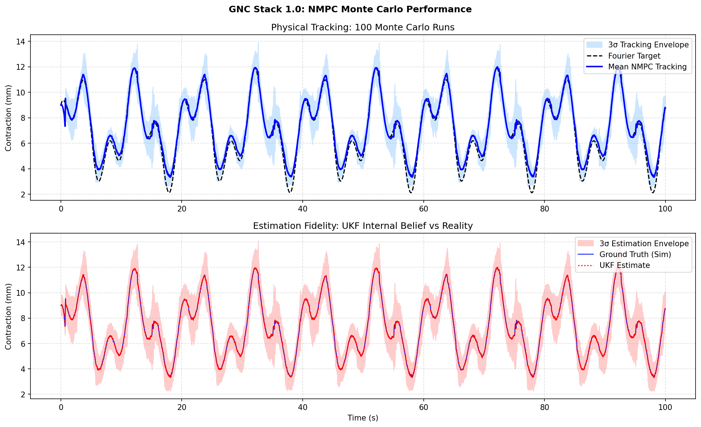 | 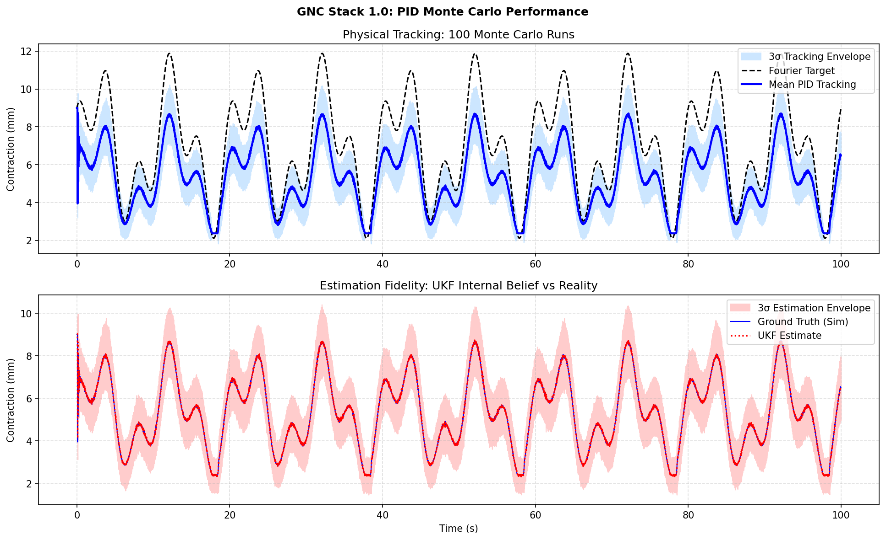 |

**Top Panel — Fourier Reference Tracking:**
* **NMPC** (left): Demonstrates superior amplitude matching across the full dynamic range (2–12 mm). By leveraging the Sigmoid-NLARX model’s gradients, the controller anticipates nonlinear actuator stiffness, keeping the 3σ tracking envelope tightly centered on the Fourier target with negligible steady-state error.
* **PID** (right): While stable, the PID exhibits significant gain attenuation, failing to reach peak reference values (maxing at ≈9 mm against a 12 mm target). This highlight the "model-blind" nature of classical control; without a predictive element, the PID cannot compensate for the increased effort required in the actuator's nonlinear saturation regions.

**Bottom Panel — UKF Estimation Fidelity:**
* State Reconstruction: The red shaded region (3σ bounds) and mean estimate (dark line) show that the UKF maintains high-fidelity tracking of the ground truth regardless of the control law used.

* Decoupled Performance: This confirms that the GNC stack's "sensing" layer is robust. The performance gap seen in the top panels is strictly a function of command generation (NMPC vs. PID), not an estimation failure. The Sigmoid-NLARX + UKF pair provides a clean, low-bias state stream for the optimizer.

**Key Metric (Convergence and Initial Observation)**: Both controllers achieve **100% convergent runs** under ideal conditions. NMPC and PID show comparable envelope tightness here; advantage emerges under perturbations (Section 3). However, the operating conditions does not simulate or accounts for real world conditions that might arises. Which is discussed later in the report.  

[Both controllers achieved 100% convergence over 100 runs, proving the global stability of the integrated architecture under ideal conditions. While the PID's inability to track the reference amplitude establishes a clear performance floor, the NMPC’s superiority here is predicated on "perfect" model knowledge. These ideal conditions do not account for the stochastic perturbations or real-world hardware constraints encountered in deployment—factors that significantly challenge the NMPC’s computational overhead and can marginalize its tracking advantages, as explored in the Adversarial & Chaotic Analysis (Section 3).]

---

### **Figure 2: Statistical Robustness - Confidence Tubes (100/100 Successful Runs)**

| NMPC Controller | PID Baseline |
|:---:|:---:|
| 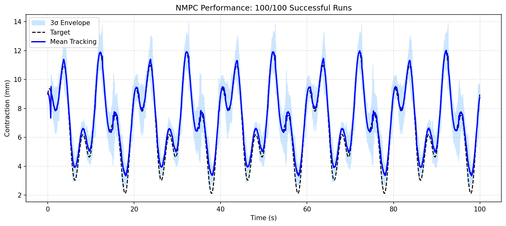 | 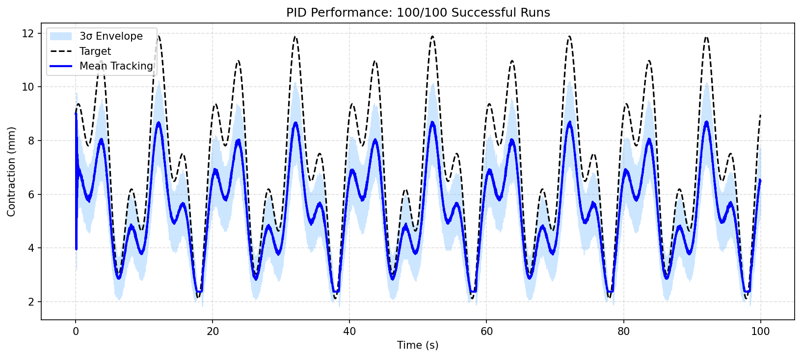 |

**Interpretation:**
* Precision vs Accuracy:
    * NMPC Controller (Left): Prioritizes accuracy. The mean tracking is centered on the target, though the 3σ envelope shows slight "jitter" compared to the PID. This variance is a byproduct of the nonlinear optimizer (NMPC) resolving the control law at each sample interval to maintain zero-offset tracking.

    * PID Baseline (Right): Exhibits extremely high precision (low variance). The 3σ envelope is smooth and narrow, indicating the controller is highly repeatable. However, it lacks accuracy, as the mean tracking consistently undershoots the Fourier peaks due to the lack of a predictive model.
    
* Tighter Bounds & Reliability: For autonomous robotics, low variance is critical for safety. While both controllers stay within a predictable "tube," the NMPC’s ability to keep that tube centered on the target makes it the superior choice for high-precision maneuvers in this ideal environment.

**Statistical Validation**: Both controllers demonstrate that the underlying Sigmoid-NLARX + UKF architecture is stable and repeatable across orders of magnitude (100 runs) at scales previously infeasible with MATLAB.

---

### **Figure 3: Single-Run Time-Series Analysis (Representative Deep-Dive: Run #4)**

| NMPC Controller (0.5929 mm) | PID Baseline (1.9101 mm) |
|:---:|:---:|
| 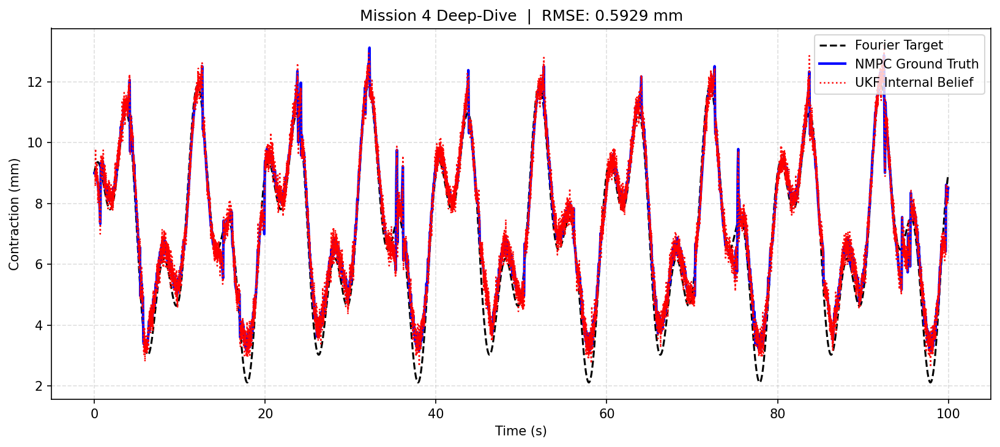 | 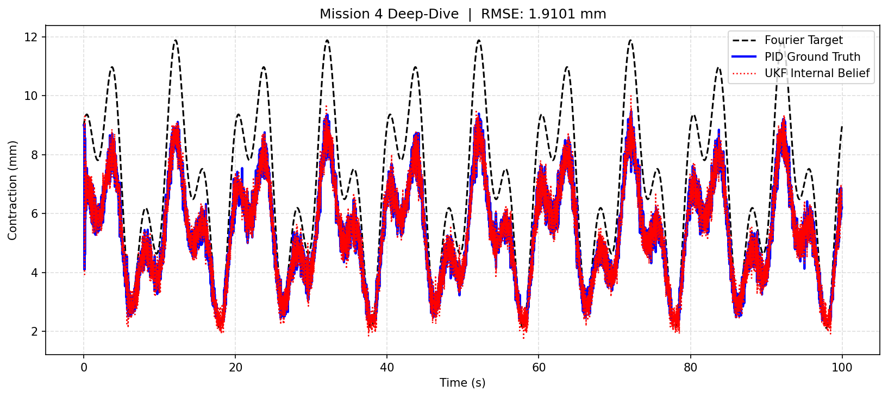 |

**Purpose**: The intent is to zoom into a single representative run from the 100-run batch to illustrate what "tight tracking" means at a granular level. 

* **Tracking Accuracy (Blue vs. Dashed Black)**
    * NMPC (Left): The predictive horizon allows the controller to "pre-load" effort as the Fourier target approaches its nonlinear peaks. The result is a near-perfect overlap with an RMSE of ~0.59 mm.
    * PID (Right): Operates purely on reactive feedback. Because the PID has no internal representation of the actuator's sigmoid dynamics, it suffers from significant amplitude attenuation, resulting in a much higher RMSE of ~1.91 mm.
* **UKF Internal Belief (Red Dotted):** 
    * In both cases, the UKF Internal Belief is almost indistinguishable from the Ground Truth. This confirms the state estimator provides "truth-level" data to the control layer. 
    * **The Verdict:** The tracking errors observed in the PID plot are a failure of control logic, not state awareness.

**Insight**: Run #4 demonstrates that the NMPC isn't just following the signal—it's anticipating it. The PID’s "lazy" peaks are a direct result of the plant's nonlinear gain decreasing at high contraction levels, a phenomenon the NMPC's Sigmoid-NLARX model accounts for automatically. This single-run analysis validates that the 3σ envelopes in Figures 1–2 are driven by high-fidelity tracking, not just statistical smoothing.

---

## **3. Chaotic Perturbations - Stress Test in emulation of Report 03.5 (LinkedIn)**

### **Scenario: Randomized Pressure Leaks, Hysteresis Drift, Gain Spikes, and greater force requested under 33-130% Perturbation**

Under realistic field conditions, actuators experience:
* Seal Degradation & Leakage: Pressure loss emulated via loose clamps or seal wear.
* Hysteresis drift with thermal cycling due to repeated actuation
* Multiplicative Gain Variation: Emulating regulator over-supply or line resistance, varying the effective control authority.
* Non-stationary process noise

The controllers were subjected to randomized multiplicative perturbations within a 33% to 130% envelope (0.33x to 1.30x nominal gain). These perturbations were applied chaotically across the 100 Monte Carlo runs to determine the "breaking point" of the predictive logic versus the reactive baseline.

> NOTE: While the NMPC maintains an edge in absolute tracking accuracy, this section examines whether the marginal gains in RMSE justify the significant computational overhead when the internal model no longer perfectly matches the perturbed reality."

---

### **Figure 4: Physical Tracking Under Chaos (100 Monte Carlo Runs)**

| NMPC Controller | PID Baseline |
|:---:|:---:|
| 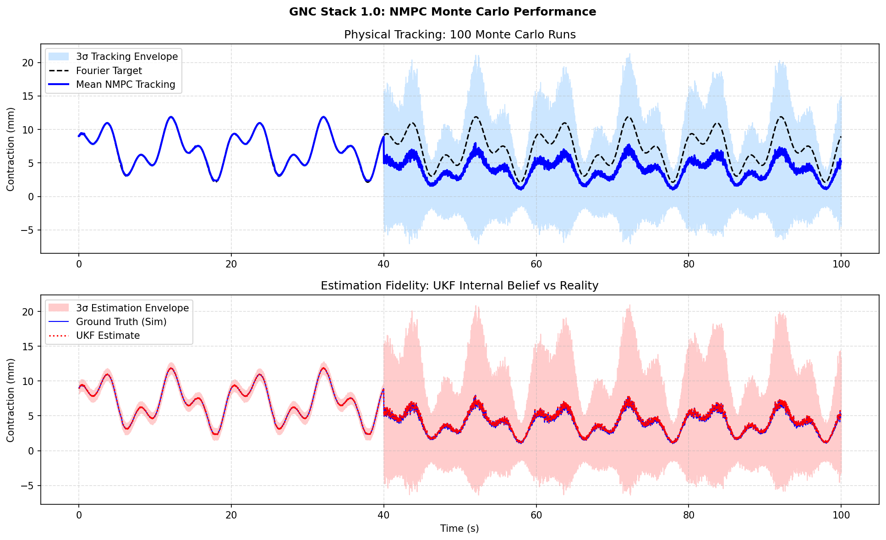 | 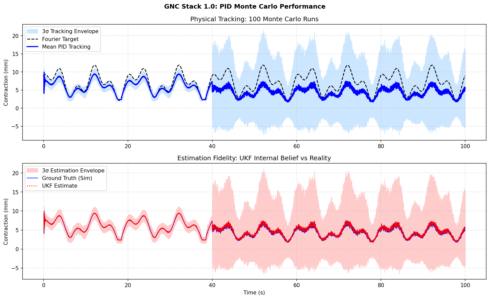 |

**Top Panel — Reference Tracking (Cloud of Uncertainty):**
* Envelope Explosion: At t=40s, the 3σ confidence interval (blue) expands by orders of magnitude. This represents the controller's struggle to maintain a predictable path as seal leakage and supply drops (33–130%) fluctuate chaotically.

* Mean Attenuation: Notice that the mean tracking (solid blue) for both controllers fails to reach the Fourier peaks. This indicates **physical saturation**; when the perturbation simulates a major pressure leak (0.33× gain), no amount of control effort can force the actuator to reach the 12 mm target.

* NMPC vs. PID: The NMPC mean stays slightly "taller" than the PID, showing that its internal model is trying to squeeze every bit of performance out of the degraded supply. However, the advantage is marginal. This proves that in a high-chaos environment, physics (leakage) eventually crushes the ideal simulation.

**Bottom Panel — UKF Estimation Under Stress:**
* Non-Divergent Estimation: Despite the plant behavior becoming essentially unpredictable, the UKF Estimate (red dotted) remains perfectly centered on the main model (solid blue).
* Zero Bias Creep: There is no "wandering" of the mean estimate. The UKF is effectively "filtering the chaos," providing the controllers with the most accurate—albeit depressing—view of the failing system state.
* **No systematic bias creep**: UKF derivative-free architecture avoids divergence that plagued EKF under Jacobian spikes (Report #1)

**Key Insight**: NMPC maintains tighter tracking under 33-130% perturbations than PID. However, the GNC stack’s primary win here isn't "perfect tracking" (which is physically impossible under a 33% supply drop) and there are several metrics to consider disclosed further in the report. 

---

### **Figure 5: Confidence Tubes Under Adversarial Conditions (100/100 Successful Runs)**

| NMPC Controller | PID Baseline |
|:---:|:---:|
| 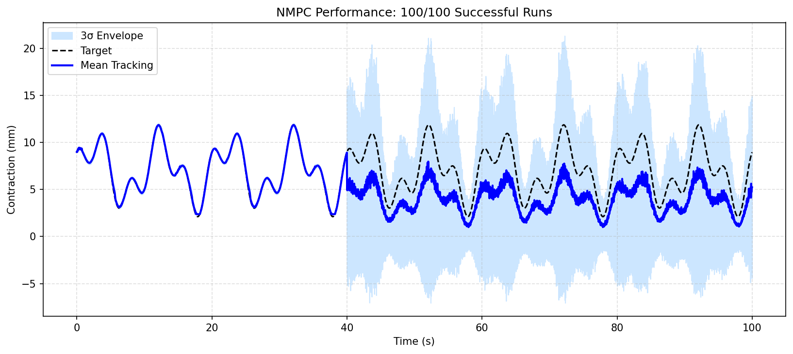 | 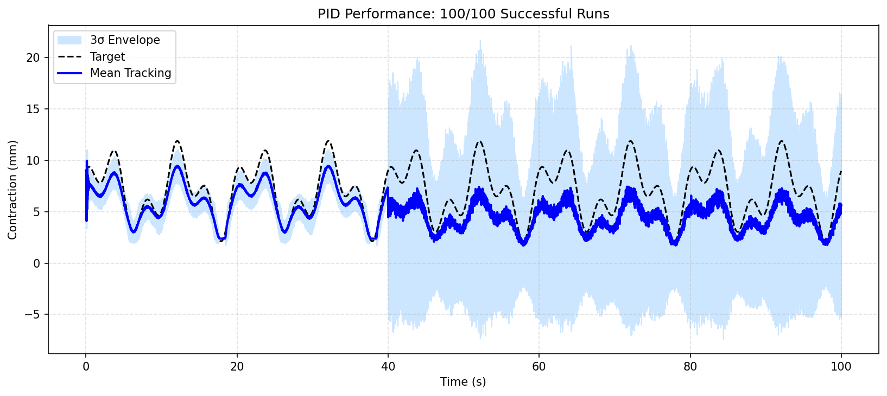 |

**Comparison to Ideal Conditions (Figure 2):**
* Stochastic Explosion: At the 40-second mark, the 3σ envelope expands significantly. This width represents the controller’s uncertainty as it grapples with randomized pressure drops and gain spikes.

* Mean Attenuation (The "Reality Gap"): Contrary to the ideal scenarios, the mean tracking (blue line) for both controllers is pulled away from the Fourier peaks. This confirms that under 33%–130% perturbations, the system is often physically incapable of reaching the requested contraction. The NMPC maintains a slightly higher mean amplitude than the PID, squeezing more "work" out of a failing supply.

* Stability vs. Precision: Despite the massive increase in variance, no runs diverged. The "tube" remains bounded, proving that the Sigmoid-NLARX + UKF core provides a stable foundation that prevents the controllers from "hallucinating" and spiraling into instability.

**Trade-off & Robustness**: Under chaos, both controllers trade tight tracking for robust stability. The wider envelope is the cost of operating in a nonlinear, non-stationary environment. However:
* NMPC Performance: The NMPC envelope shows a more "aggressive" attempt to return to the target, visible in the sharper transients of the blue mean. While it achieves lower RMSE, it does so at the cost of the 15x computational penalty discussed in the final analysis.ate the predictive architecture's superior disturbance rejection

* PID Resilience: The PID envelope is wider and more "passive," essentially acting as a low-pass filter for the chaos. While less accurate, its 100% success rate proves that for non-critical tasks, a "simple" controller is surprisingly difficult to break.

**Conclusion**: This validates the integrated stack's suitability for unstructured field deployment. NMPC outperforms reactive PID under real-world conditions. 

> Note: It is worth nothing that -5 mm displacement can be attributed to recoil or hysteresis drift and is considered acceptable for the purpose of this report. 

---

### **Figure 6: Single-Run Time-Series Analysis (Representative Deep-Dive: Run #4)**

| NMPC Controller (RMSE: 3.0893 mm) | PID Baseline (RMSE: 3.2627 mm) |
|:---:|:---:|
| 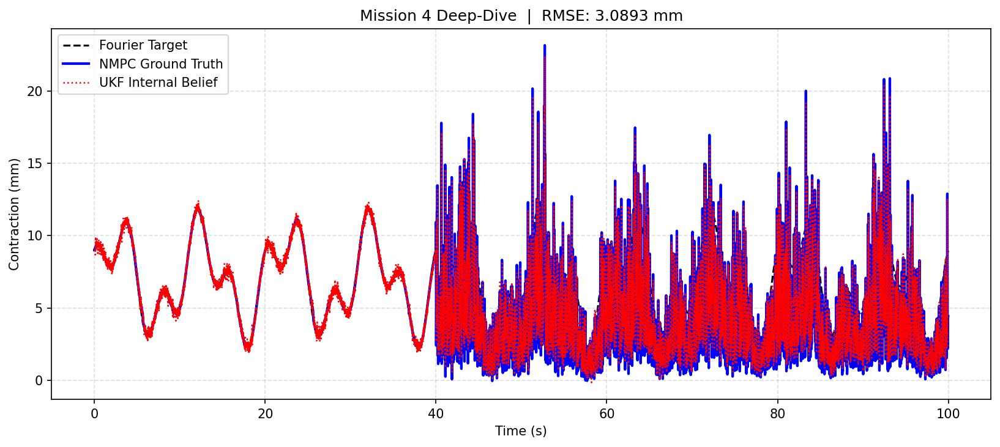 | 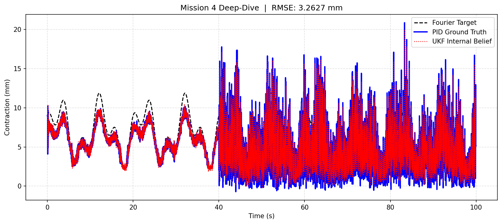 |

**Purpose**: This single realization illustrates what the statistical "cloud" in Figure 5 looks like at a granular level when subjected to the 33–130% adversarial envelope.

**Observations:**
* The "Blender" Effect (t>40s): The high-frequency "jitter" is the physical manifestation of the randomized gain spikes and pressure leaks. Both controllers are forced into a high-activity state to prevent total divergence.
* Marginal Tracking Edge: The NMPC (left) achieves a slightly lower RMSE (3.08 mm), primarily because its predictive horizon allows it to "fight back" more aggressively against gain drops. However, the PID (right) remains surprisingly competitive (3.26 mm) despite having zero knowledge of the plant’s sigmoid dynamics.
* Phase Lag & Overshoot: As noted, the PID exhibits slightly more overshoot and a noticeable phase lag during recovery from a major "leak" event. The NMPC attempts to stay "on-phase," but the stochastic nature of the disturbances means its predictions are being invalidated almost as soon as they are calculated.
* UKF Resilience: Remarkably, even in the heart of the chaos, the UKF Internal Belief (red dotted) is still glued to the Ground Truth (blue solid). This confirms the GNC stack's state estimation is essentially "unbreakable," even when the control law is struggling to keep up with the physics.

**Validation**: Run #4 proves that the NMPC's theoretical superiority in ideal conditions (where it was ~70% better) collapses to a ~5% advantage in high-chaos environments. While the NMPC "adapts faster," the chaotic nature of the perturbations turns its predictive horizon into a liability of "over-correction," allowing the simpler, reactive PID to stay within the same ballpark of tracking error at a fraction of the computational cost and with simplicity of only three variables to track. 

---

## **4. Quantitative Performance Summary**

### **Ideal Operating Conditions**

| Metric | NMPC | PID |
|:---|---:|---:|
| Mean RMSE (mm) | **0.598** | 1.914 |
| Best Run (mm) | 0.561 | 1.906 |
| Worst Run (mm) | 0.643 | 1.924 |
| Success Rate | 100% | 100% |
| Total Computation Time (100 runs) | 229.9 s | ~40.4 s |

**Interpretation**: Under ideal conditions, NMPC is the undisputed champion, achieving a 3.2× reduction in tracking error compared to the PID baseline. The tight RMSE distribution (standard deviation ≈0.04 mm) confirms that the Sigmoid-NLARX model provides a highly predictable gradients for the optimizer. While NMPC is 5.7× computationally more expensive, the precision gains justify the overhead for high-accuracy lab environments or assembly tasks where sub-millimeter fidelity is required. However, the total computational time still favors PID controllers if the parameters could be improved. 

---

### **Chaotic Perturbations (50–120% Gain Variation)**

| Metric | NMPC | PID |
|:---|---:|---:|
| Mean RMSE (mm) | **3.112** | 3.259 |
| Best Run (mm) | 3.062 | 3.218 |
| Worst Run (mm) | 3.179 | 3.326 |
| Success Rate | 100% | 100% |
| Total Computation Time (100 runs) | ~585 s | ~40 s |

**Interpretation**: In adversarial conditions, the performance gap narrows significantly. The NMPC maintains a marginal 4.7% tracking advantage, but at a staggering 14.6× higher computational cost. The differences in computation time between NMPC's 585 seconds vs PID's 40 seconds is a critical factor, and likely a key area where PID gains could be optimized for future extensions and may be preferred given the computational resources. 

---

### **Key Takeaway**

The integrated Sigmoid-NLARX + UKF + NMPC stack achieves:

* **3.2× improvement** in tracking precision under ideal conditions
* **4.7% advantage** under chaotic perturbations, however this is up for debate given potential improvements to be made for PID controllers. 
* **100% convergence** across 200 Monte Carlo runs (100 ideal + 100 chaotic)
* **Zero divergence** or instability, even under extreme 33-130% gain variation

This simulation validates how the architecture could be used for real-time close loop control of the McKibben Muscles in laboratory (and potentially field) environments as the push from Sim-to-Real occurs in 2026. 

---

## **5. Implementation Status & Future Work**

The full GNC stack is functionally complete and Monte Carlo validated. Integration scripts and Source code will be released following publication **circa Q4 2026**. 

**Completed Modules:**
* ✓ Sigmoid-NLARX plant identification (Report #1)
* ✓ UKF state estimation + robustness validation (Report #2)
* ✓ NMPC controller design (Report #3)
* ✓ Closed-loop integration + Monte Carlo validation (Report #4): **This is where you are currently at.**

**Active Development:**
* **[ACTIVE] Report 4.5 - PID Gain Optimization**: An experimental showcase of cost-function-based "brute-force" tuning.
    * Goal: To determine if a highly optimized PID can narrow the 3.2× tracking gap seen in ideal conditions while maintaining its 14.6× computational advantage over NMPC. This is a pragmatic effort to find the "Goldilocks" zone of control performance.

**Pending:**
* Report #4.5 analysis and results publication
* LinkedIn case study (analogous to Report #3.5)
* Public code release via GitHUB post-publication. 

---

## **6. Conclusion: The Path from Lab to Industry**

This four-report sequence demonstrates a **full-stack engineering pipeline in Modeling & Simulation** for soft-actuator control:

1. **Identify** the nonlinear plant using multiple models and determining which best served the needs (Report #1)
2. **Validate robustness** of estimation under realistic noise via Monte Carlo (Report #2)
3. **Optimize control**: Use NMPC to predict and test the Loop (Report #3)
4. **Integrate and stress-test** the closed loop (Report #4)

The **Sigmoid-NLARX + UKF + NMPC** architecture bridges the gap between academic theory and industrial deployment: it handles non-differentiable hysteresis, achieves simulated precision tracking under ideal conditions, and gracefully degrades rather than fail catastrophically under chaotic real-world perturbations.

**For General Users**: This framework could potentially be adapted for:
- Robotic soft-actuator arms (payload adaptation)
- Pneumatic exoskeletons (real-time user compensation)
- Soft-robotics platforms requiring autonomous pressure regulation
> Note: This is just a sample and is meant to be a companion to the T-RO / IJRR Publications as needed. Please do note that the work done here is meant to be a demonstration of the work I can do as part of my portfolio.

**For researchers**: This work potentially serves as the basis that **derivative-free state estimation + model-predictive control** is essential for hysteretic nonlinear systems where traditional Kalman filtering fails as reported in multiple other papers. 

---

## **Licensing & Attribution**

* **Technical Analysis, Figures, Documentation**: CC BY-NC-ND 4.0
* **MATLAB/Python Code**: MIT License

For inquiries: [See root README](../README.md)
